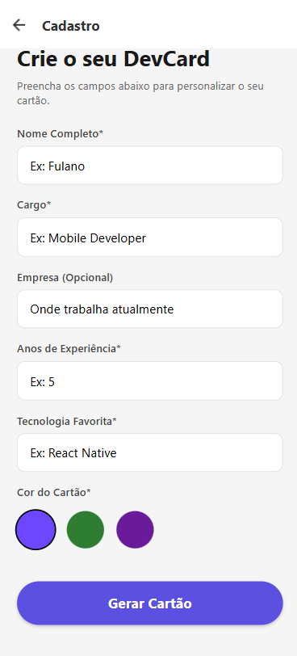
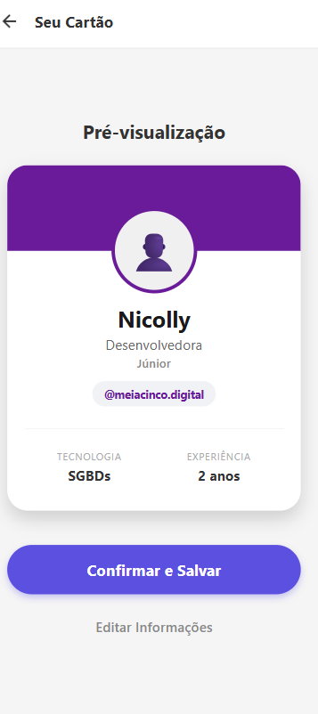
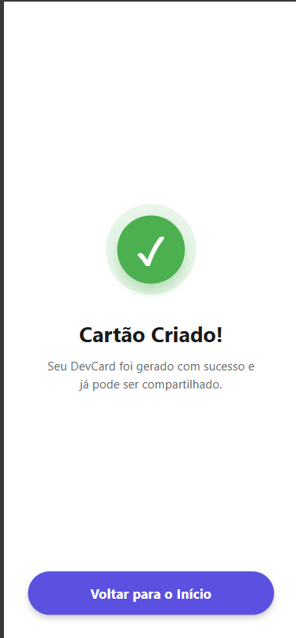

# 💳 DevCard - Gerador de Cartão de Visitas Digital

O **DevCard** é uma aplicação mobile desenvolvida em **React Native** (Expo) que permite a desenvolvedores criarem um cartão de visitas personalizado em tempo real. O projeto foca em uma interface limpa (UI), experiência do usuário fluida (UX) e lógica de negócios para classificação de níveis profissionais.

## 🚀 Funcionalidades

* **Cadastro Dinâmico:** Formulário com validação de campos obrigatórios e feedback de erro.
* **Classificação Automática:** O app define se o desenvolvedor é *Júnior*, *Pleno* ou *Sênior* com base nos anos de experiência informados.
* **Personalização de Cores:** Escolha de temas (Azul, Verde, Roxo) que alteram visualmente o cartão final.
* **Preview em Tempo Real:** Visualização do cartão no estilo "Badge de Conferência" antes da finalização.
* **Design Moderno:** Interface limpa, sem elementos genéricos, focada em componentes nativos de alta qualidade.
* **Navegação Fluida:** Sistema de rotas utilizando `expo-router`.

## 📸 Screenshots

Aqui estão as principais telas da aplicação:
| Home & Cadastro | Preview do Cartão | Sucesso |
| :---: | :---: | :---: |
|  |  |  |

## 🛠️ Tecnologias Utilizadas

* **React Native**
* **Expo** (SDK 50+)
* **TypeScript**
* **Expo Router** (File-based routing)
* **StyleSheet** (CSS-in-JS para estilização nativa)

## 🏗️ Estrutura do Projeto

* `app/index.tsx`: Tela de boas-vindas.
* `app/cadastro.tsx`: Formulário de entrada de dados.
* `app/preview.tsx`: Tela de visualização do cartão gerado.
* `app/sucesso.tsx`: Confirmação final com feedback visual.
* `app/_layout.tsx`: Configuração global de navegação e cabeçalhos.

## 📥 Como rodar o projeto

1.  **Clone o repositório:**
    ```bash
    git clone https://github.com/NicollyMendes/DevCard.git
    ```

2.  **Instale as dependências:**
    ```bash
    npm install
    ```

3.  **Inicie o Expo:**
    ```bash
    npx expo start
    ```

4.  **Abra no seu dispositivo:**
    Escaneie o QR Code com o app **Expo Go**.

---
Desenvolvido por Nicolly Mendes Cescon - Aula 7 de Aplicações Móveis.
